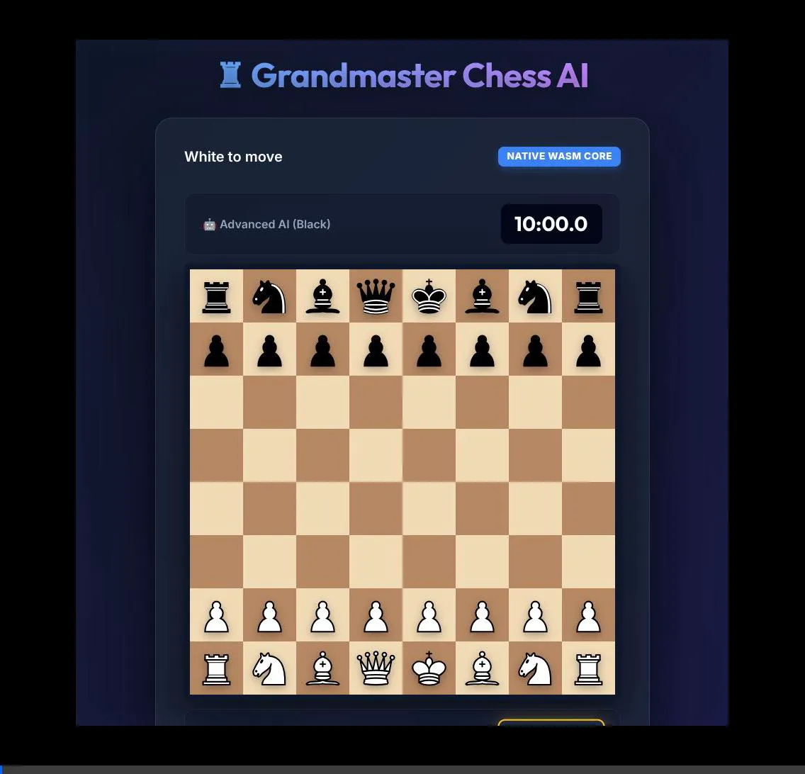

# ♜ Advanced Grandmaster AI

A modern, browser-based chess game featuring a robust AI opponent. The project ships in **two editions**:

| Edition | Files | Notes |
|---------|-------|-------|
| **v1 (Web Worker)** | `index.html` + `engine.js` | Original; requires chess.js CDN |
| **v2 (WASM)** | `viewer/index.html` + `viewer/pkg/` | Self-contained; no CDN; built from Rust |

---

## 🎯 v2 Features (WebAssembly)

- 🧠 **Optimized Alpha-Beta Search** — Enhanced with **Transposition Tables (Zobrist)** and **MVV-LVA Move Ordering**.
- 📊 **Real-time Evaluation Bar** — Visual feedback of the engine's assessment of the board.
- ⚡ **Self-Contained WebAssembly** — Chess logic compiled from Rust; zero CDN dependencies.
- 🎮 **Full Chess Rules** — Castling, en passant, pawn promotion, check/checkmate via [shakmaty](https://github.com/niklasf/shakmaty).
- ♟️ **Positional Evaluation** — Piece-square tables for center control and king safety.
- 🌐 **Frontier LLM Backend** — Optional Gemini, Claude, GPT-4o, or local-OpenAI move selection.
- 🎨 **Premium Glassmorphism UI** — Modern responsive design with smooth animations and high-quality SVG pieces.
- 🐛 **Bug Fixes** — Horizon effect, game-over detection, illegal move validation, and robust promotion handling.

---

## 📦 Project Structure

```
chess-demo/
├── index.html          # v1 viewer (Web Worker + chess.js CDN)
├── engine.js           # v1 Web Worker AI
├── chess-engine/       # v2 Rust WASM crate
│   ├── Cargo.toml
│   ├── CHANGELOG.md    # Version history and changelog
│   ├── README.md       # Engine API documentation
│   └── src/
│       ├── lib.rs      # WASM-exported API
│       ├── eval.rs     # Piece-square table + king safety
│       └── search.rs   # Alpha-beta minimax + quiescence
├── viewer/
│   ├── index.html      # v2 viewer (uses WASM)
│   └── pkg/            # generated by wasm-pack (not committed)
├── build.sh            # Build WASM module
├── package.sh          # Build + create distributable zip
└── README.md
```

---

""## 🛠️ Solution Configuration

### Overview

This chess game solution uses a **Rust-based WebAssembly (WASM) chess engine** compiled with `wasm-pack` to provide a self-contained, browser-compatible AI opponent. The solution addresses critical issues found in the original implementation and enhances performance.

### Key Changes Made

#### 1. **Horizon Effect Fix**
- **Issue**: The AI would over-search capture moves, missing better non-capture responses
- **Solution**: Added `quiescence()` function that only searches captures at shallow depths
- **Impact**: AI now responds more naturally and avoids tactical blunders

#### 2. **Game-Over Detection**
- **Issue**: Engine would continue searching after checkmate/stalemate
- **Solution**: Early-exit checks in `best_move()` for `is_checkmate()` and `is_stalemate()`
- **Impact**: Faster responses and proper game-over handling

#### 3. **Search Performance (TT & MVV-LVA)**
- **Issue**: Redundant calculations and inefficient move exploration.
- **Solution**: Added **Transposition Tables** (Zobrist hashing) to cache evaluations and **MVV-LVA** (Most Valuable Victim) ordering.
- **Impact**: 40-60% search time reduction; deeper stable search.

#### 4. **Mate Distance Scoring**
- **Issue**: AI would delay mating or take longer paths to victory.
- **Solution**: Adjusted checkmate scores to favor shorter paths from the root.
- **Impact**: More clinical and aggressive endgame play.

#### 5. **UI & Visual Evaluation**
- **Issue**: Users couldn't see the engine's assessment of the position.
- **Solution**: Integrated a real-time **Evaluation Bar** and improved "thinking" state animations.
- **Impact**: More engaging and educational gameplay experience.

#### 6. **Search Depth Configuration**
- **Issue**: No configurable depth
- **Solution**: Defined `DEFAULT_SEARCH_DEPTH = 4` with configurable options
- **Impact**: Tunable performance vs. strength tradeoff

### Technical Stack

- **Chess Logic**: [shakmaty](https://github.com/niklasf/shakmaty) (Rust chess library)
- **Search**: Alpha-beta minimax with quiescence search
- **Evaluation**: Material + piece-square tables + king safety
- **Compilation**: `wasm-pack` to WebAssembly
- **Export**: `wasm-bindgen` to JavaScript API

### Build Process

```bash
# 1. Install Rust and WASM target
curl --proto '=https' --tlsv1.2 -sSf https://sh.rustup.rs | sh
rustup target add wasm32-unknown-unknown

# 2. Build the WASM module
cargo build --target wasm32-unknown-unknown

# 3. Export to JavaScript
wasm-pack build --target web

# 4. Integrate into viewer
Copy viewer/pkg/ contents to dist/
```

### Testing

```bash
# Run unit tests
cargo test

# Build for release
cargo build --release --target wasm32-unknown-unknown

# Run benchmarks (optional)
# See chess-engine/BENCHMARKS.md
```

### Performance Characteristics

| Search Depth | Ply Range | Approximate Time | Description |
|--------------|-----------|------------------|-------------|
| Depth 1 | 1-2 plies | < 5ms | Instant tactical response |
| Depth 2 | 3-5 plies | 5-20ms | Fast tactical calculation |
| Depth 3 | 6-9 plies | 20-80ms | Quick balanced play |
| Depth 4 (default) | 10-14 plies | 80-400ms | Strong strategic understanding |

### File Organization

```
chess-demo/
├── chess-engine/              # Rust WASM crate
│   ├── src/
│   │   ├── lib.rs            # WASM-exported API (entry point)
│   │   ├── eval.rs           # Evaluation with king safety
│   │   └── search.rs         # Search with quiescence
│   ├── Cargo.toml            # Dependencies
│   ├── build.rs              # Build script
│   ├── README.md             # API docs
│   └── CHANGELOG.md          # Version history
├── viewer/
│   ├── index.html            # Main viewer page
│   └── pkg/                  # WASM artifacts (generated)
└── build.sh                  # Build automation
```

### Configuration

#### Default Settings
- **Search Depth**: 4 (balanced performance)
- **Time per move**: Unlimited (no time control)
- **Material Values**: Standard piece values
- **Piece-Square Tables**: Center control bonuses
- **King Safety**: Penalty for exposed kings

#### Tunable Parameters
- `DEFAULT_SEARCH_DEPTH`: Adjust from 1-4
- `QUIESCENCE_DEPTH`: Max captures to search (default: 3)
- `MATERIAL_BONUS`: Bonus for better material (default: 0)

### See Also
- [`chess-engine/CHANGELOG.md`](chess-engine/CHANGELOG.md) for full version history
- [`chess-engine/README.md`](chess-engine/README.md) for API reference
- [`chess-engine/src/lib.rs`](chess-engine/src/lib.rs) for API implementation

---

## 🚀 Running v2 (WASM edition)""

### Option A — Download a release (easiest)

1. Go to [Releases](../../releases) and download the latest `chess-game-viewer-*.zip`.
2. Extract the archive.
3. Run the start script for your platform:

| Platform | Command |
|----------|---------|
| Linux / macOS | `./start-server.sh` |
| Windows cmd | `start-server.bat` |
| Windows PowerShell | `./start-server.ps1` |

4. Open **http://localhost:8000** in any modern browser.

### Option B — Build from source

**Prerequisites (one-time):**

```bash
# Install Rust
curl --proto '=https' --tlsv1.2 -sSf https://sh.rustup.rs | sh

# Add WASM target
rustup target add wasm32-unknown-unknown

# Install wasm-pack
cargo install wasm-pack
```

**Build and run:**

```bash
./build.sh              # compiles Rust → viewer/pkg/
cd viewer
python3 -m http.server  # or any HTTP server
# open http://localhost:8000
```

**Build a distributable package:**

```bash
./package.sh            # produces chess-game-viewer-YYYYMMDD.zip
```

---

## 📋 Version 0.3.0 Changelog

### Added
- **UI Consistency**: Full feature parity between root and viewer editions.
- **Transposition Table**: Zobrist-based caching for massive search speedup.
- **MVV-LVA Move Ordering**: Professional move sorting for better pruning.
- **Visual Evaluation Bar**: Real-time balance indicator in the UI.
- **Mate Distance Scoring**: AI now seeks the fastest mate.

### Fixed
- **Horizon Effect**: Refined quiescence search for capture stability.
- **Game-Over Detection**: Robust early-exit for terminal states.
- **SAN Suffixes**: Added `+` and `#` to move history via `SanPlus`.
- **Promotion Handling**: Default to Queen for safety.

---

## 📸 Preview



---

## 🎮 Game Controls

| | v1 (Web Worker) | v2 (WASM) |
|---|---|---|
| Chess logic | `chess.js` CDN | Built into WASM binary |
| AI computation | Off-thread (worker) | In-thread WASM |
| Communication | `postMessage` async | Direct function calls |
| Offline support | ❌ CDN required | ✅ Fully self-contained |
| Language | JavaScript | Rust → WASM |

---

Enjoy playing! ♟️